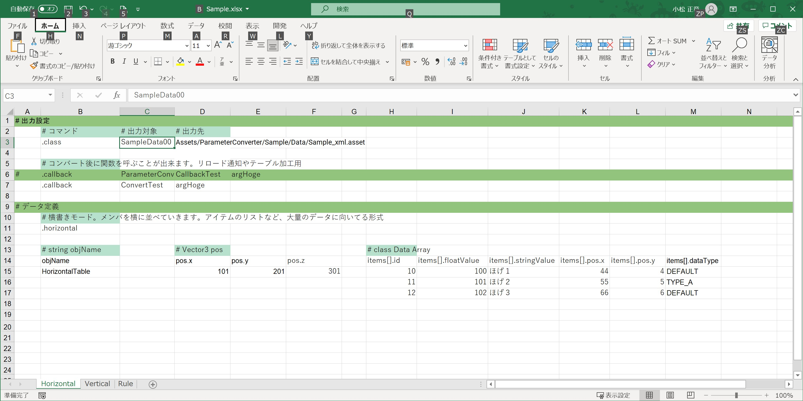

# ParameterConverter

## Function

スプレッドシートやCSVで記述したパラメーターをScriptableObjectにシリアライズします。

パラメーターとして記述できるデータはネイティブな型と、class、structです。

記述した値は対応するメンバーの型に応じて変換されます。

## How to use

サンプルデータはExcelのスプレッドシート2003形式です。

~~~C#
// コンバートは対象となるファイル名を渡すだけです。
public class Test {
    void ConvertTest() {
        var context = new CellDataContext();
        var list = new [] {"Assets/Sample/Data/Sample.xlsx"};
        CellDataConverter.Convert(context, list);
    }
}
~~~

~~~C#
// 上記のデータで以下のScriptableObjectにシリアライズされます。
using UnityEngine;
using ParameterConverter;

[ParameterTarget("SampleData00")]
public class SampleData : ScriptableObject
{
    public enum DataType
    {
        DEFAULT,
        TYPE_A,
    }

    [SerializeField]
    private string objName;
    public string ObjName => objName;

    [SerializeField]
    private Vector3 pos;
    public Vector3 Pos => pos;

    [SerializeField]
    private Item[] items;
    public Item[] Items => items;

    [System.Serializable]
    public class Item
    {
        [SerializeField]
        private int id;
        public int Id => id;

        [SerializeField]
        private DataType dataType;
        public DataType DataType => dataType;

        [SerializeField]
        private float floatValue;
        public float FloatValue => floatValue;

        [SerializeField]
        private string stringValue;
        public string StringValue => stringValue;

        [SerializeField]
        private Vector3 pos;
        public Vector3 Pos => pos;
    }
}
~~~

## Supported input types

- Excelスプレッドシート2003
- CSV

CellDataオブジェクトに変換すれば他のフォーマットにも対応できます。

## How to write parameters

### コメントの書き方

セルの先頭に'#'を入れることで、それ以降の列を無視します。

### メンバー変数の書き方

classもstructも記述方法は同じです。

定義が Vector3 pos; の場合、パラメーター側はメンバ名をpos.xという指定になります。

### 配列の書き方

ScriptableObjectのルート階層には1次元配列を1種類だけ記述できます。

以下のようなItemクラスの配列が定義されている場合、

~~~~C#
class Item {
    int val;
}

Item[] items;
~~~~

パラメーター側ではitems[].valという指定になります。

カッコを入れることで配列として認識し、配列に流し込まれます。

### 配列のマージ

別のワークシートであっても出力先が同じ場合、各ワークシートの配列がマージされます。

マージの順序はワークシートの並び順です。

この機能は長い配列をシートを分けて記述するとき用の機能です。

### IDの重複チェック

配列のシリアライズ対象のメンバ名がidの場合、値が重複しているとエラーになります。

これはレコードを表す一意なIDとして扱いたい場合用のエラーチェックです。

## Command

コマンドはドット'.'で始まる文字列です。

コマンドに引数が存在する場合はコマンドに続けて右側に記述していきます。

### .class

    .class 出力対象のラベル名 出力先

シリアライズ対象のクラスと、ScriptableObjectの出力先を指定します。

1シートに付き.class指定が1個必要です。

出力対象はクラスに対し、ParameterTargetAttributeでラベル名をつけて指定します。

### .horizontal

    .horizontal

横書きでのデータ記述の開始を表します。

横書きというのはメンバを横に並べ、配列が下に伸びる形式です。

アイテムやキャラのパラメーターなど、大量のデータを記述することに適しています。

### .vertical

    .vertical

縦書きでのデータ記述の開始を表します。

縦書きはメンバを縦に並べ、配列が右に伸びる形式です。

設定ファイルのような、メンバの種類が多く、配列が少ない場合に使いやすいです。

### .end

    .end

ワークシートの解析を終了します。

説明のみのワークシート用です。

### .callback

    .callback コールバック関数のラベル名 引数

コンバート終了後に指定した関数を呼び出します。

データを更新したら自動的にリロードしたい、とかの用途です。

呼び出す関数は、関数にAffterCallbackAttributeでラベル名をつけて指定します。

